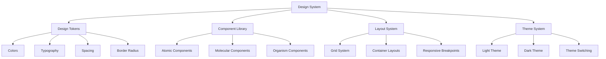
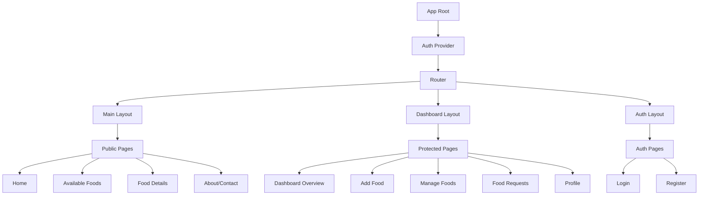

# Design Document: PlateShare UI/UX Enhancement

## Overview

This design document outlines the comprehensive UI/UX enhancement for the PlateShare food sharing application. The design focuses on creating a modern, accessible, and professional platform that meets contemporary web standards while maintaining the existing React + Tailwind CSS + DaisyUI technology stack.

The enhancement will transform PlateShare into a portfolio-ready application with consistent design patterns, responsive layouts, role-based dashboards, and comprehensive user experience improvements.

## Architecture

### Technology Stack
- **Frontend Framework**: React 19.2.0
- **Styling**: Tailwind CSS 4.1.17 with DaisyUI 5.5.14
- **Authentication**: Firebase Auth
- **Routing**: React Router 7.9.5
- **State Management**: React Context API
- **Animations**: Framer Motion 12.23.26
- **Icons**: Lucide React + React Icons
- **Notifications**: React Hot Toast + React Toastify

### Design System Architecture



### Application Architecture



## Components and Interfaces

### Design Token System

**Color Palette (Maximum 3 Primary + Neutrals)**
```javascript
const designTokens = {
  colors: {
    primary: {
      50: '#fef9ee',   // Light amber background
      100: '#fef3c7',  // Lighter amber
      500: '#ebc15e',  // Main amber (existing)
      600: '#b48518',  // Darker amber (existing)
      900: '#ac7800'   // Darkest amber
    },
    secondary: {
      50: '#fdf2f8',   // Light rose
      500: '#8d5751',  // Main rose-brown
      600: '#7c4a44',  // Darker rose-brown
      900: '#5c2e2a'   // Darkest rose-brown
    },
    accent: {
      50: '#f0fdf4',   // Light green
      500: '#22c55e',  // Success green
      600: '#16a34a',  // Darker green
      900: '#14532d'   // Darkest green
    },
    neutral: {
      50: '#fafafa',   // Lightest gray
      100: '#f5f5f5',  // Light gray
      200: '#e5e5e5',  // Border gray
      500: '#737373',  // Medium gray
      700: '#404040',  // Dark gray
      900: '#171717'   // Darkest gray
    }
  },
  spacing: {
    xs: '0.5rem',    // 8px
    sm: '0.75rem',   // 12px
    md: '1rem',      // 16px
    lg: '1.5rem',    // 24px
    xl: '2rem',      // 32px
    '2xl': '3rem',   // 48px
    '3xl': '4rem'    // 64px
  },
  borderRadius: {
    sm: '0.375rem',  // 6px
    md: '0.5rem',    // 8px
    lg: '0.75rem',   // 12px
    xl: '1rem'       // 16px
  }
}
```

### Component Specifications

#### Card Component
```javascript
const CardComponent = {
  dimensions: {
    width: 'w-full',
    height: 'h-80', // Fixed height for consistency
    aspectRatio: '4:3'
  },
  styling: {
    borderRadius: 'rounded-lg',
    shadow: 'shadow-md hover:shadow-lg',
    background: 'bg-base-100',
    border: 'border border-base-200'
  },
  layout: {
    desktop: 'grid-cols-4', // 4 cards per row
    tablet: 'grid-cols-2',  // 2 cards per row
    mobile: 'grid-cols-1'   // 1 card per row
  },
  content: {
    image: 'aspect-video object-cover',
    title: 'text-lg font-semibold line-clamp-2',
    description: 'text-sm text-base-content/70 line-clamp-3',
    metadata: 'text-xs text-base-content/60',
    button: 'btn btn-primary btn-sm'
  }
}
```

#### Navigation Component
```javascript
const NavigationComponent = {
  navbar: {
    position: 'sticky top-0 z-50',
    background: 'bg-base-100/95 backdrop-blur-sm',
    shadow: 'shadow-sm',
    height: 'h-16',
    padding: 'px-4 lg:px-8'
  },
  logo: {
    size: 'w-12 h-12',
    text: 'text-xl font-bold text-primary'
  },
  links: {
    loggedOut: ['Home', 'Available Foods', 'About'],
    loggedIn: ['Home', 'Available Foods', 'Dashboard', 'Add Food', 'Profile']
  },
  dropdown: {
    trigger: 'avatar btn-circle',
    menu: 'dropdown-end w-52',
    items: ['Profile', 'Dashboard', 'Add Food', 'Manage Foods', 'My Requests', 'Logout']
  }
}
```

#### Dashboard Layout
```javascript
const DashboardLayout = {
  structure: {
    sidebar: 'w-64 min-h-screen bg-base-200',
    main: 'flex-1 bg-base-100',
    topbar: 'h-16 bg-base-100 border-b'
  },
  sidebar: {
    width: {
      desktop: 'w-64',
      collapsed: 'w-16',
      mobile: 'w-full fixed inset-y-0 z-40'
    },
    menu: {
      user: ['Dashboard', 'My Foods', 'My Requests', 'Profile'],
      admin: ['Dashboard', 'All Foods', 'All Users', 'Analytics', 'Settings']
    }
  },
  responsive: {
    breakpoint: 'lg:flex',
    mobileToggle: 'lg:hidden',
    overlay: 'fixed inset-0 bg-black/50 lg:hidden'
  }
}
```

## Data Models

### Theme Configuration
```javascript
const ThemeConfig = {
  light: {
    primary: '#ebc15e',
    secondary: '#8d5751',
    accent: '#22c55e',
    neutral: '#f5f5f5',
    'base-100': '#ffffff',
    'base-200': '#f5f5f5',
    'base-300': '#e5e5e5',
    'base-content': '#171717'
  },
  dark: {
    primary: '#ebc15e',
    secondary: '#8d5751',
    accent: '#22c55e',
    neutral: '#2a2a2a',
    'base-100': '#1f1f1f',
    'base-200': '#2a2a2a',
    'base-300': '#3a3a3a',
    'base-content': '#ffffff'
  }
}
```

### Component State Models
```javascript
const ComponentStates = {
  loading: {
    skeleton: 'animate-pulse bg-base-300',
    spinner: 'loading loading-spinner',
    overlay: 'loading loading-dots loading-lg'
  },
  error: {
    message: 'alert alert-error',
    retry: 'btn btn-outline btn-error'
  },
  success: {
    message: 'alert alert-success',
    confirmation: 'btn btn-success'
  },
  empty: {
    illustration: 'w-32 h-32 opacity-50',
    message: 'text-base-content/60',
    action: 'btn btn-primary'
  }
}
```

### Responsive Breakpoints
```javascript
const ResponsiveBreakpoints = {
  mobile: '320px - 767px',
  tablet: '768px - 1023px',
  desktop: '1024px+',
  
  gridCols: {
    mobile: 1,
    tablet: 2,
    desktop: 4
  },
  
  navigation: {
    mobile: 'drawer-mobile',
    desktop: 'navbar-horizontal'
  }
}
```

## Correctness Properties

*A property is a characteristic or behavior that should hold true across all valid executions of a system—essentially, a formal statement about what the system should do. Properties serve as the bridge between human-readable specifications and machine-verifiable correctness guarantees.*

### Property Reflection

After analyzing all acceptance criteria, several properties can be consolidated to eliminate redundancy:

- Properties about consistent styling (1.3, 1.4, 4.4, 10.3) can be combined into a comprehensive design system consistency property
- Properties about responsive design (1.6, 2.7, 11.2) can be unified into a single responsive behavior property  
- Properties about content quality (1.8, 10.4, 11.1) can be merged into one content standards property
- Properties about loading states (5.6, 12.1, 12.2) can be combined into a comprehensive loading experience property
- Properties about accessibility (11.5, 11.6, 11.7) can be unified into a single accessibility compliance property

### Converting EARS to Properties

Based on the prework analysis, here are the consolidated correctness properties:

**Property 1: Design System Consistency**
*For any* component or page in the PlateShare system, all styling should use design tokens from the centralized design system rather than hardcoded values, ensuring consistent colors, spacing, typography, and visual patterns throughout the application
**Validates: Requirements 1.3, 1.4, 4.4, 10.3**

**Property 2: Color Palette Compliance**
*For any* theme configuration, the color system should contain exactly 3 primary color groups (primary, secondary, accent) plus neutral colors, with no additional primary color groups
**Validates: Requirements 1.1**

**Property 3: Theme Contrast Accessibility**
*For any* text-background color combination in both light and dark themes, the contrast ratio should meet or exceed WCAG AA standards (4.5:1 for normal text, 3:1 for large text)
**Validates: Requirements 1.2, 11.5**

**Property 4: Responsive Layout Behavior**
*For any* component or page, the layout should adapt correctly at mobile (320-767px), tablet (768-1023px), and desktop (1024px+) breakpoints using appropriate responsive classes and maintaining usability
**Validates: Requirements 1.6, 2.7, 11.2**

**Property 5: Card Component Uniformity**
*For any* card component instance, all cards should use identical base classes for dimensions, border radius, shadow, and layout structure, ensuring visual consistency across the application
**Validates: Requirements 1.4, 5.4**

**Property 6: Form Validation Completeness**
*For any* form in the system, validation rules should be present for all required fields, with appropriate error messages, success states, and loading indicators displayed based on form state
**Validates: Requirements 1.5, 8.1, 8.2**

**Property 7: Touch Target Accessibility**
*For any* interactive element on mobile devices, the touch target should be at least 44px in height and width with appropriate spacing to prevent accidental activation
**Validates: Requirements 1.7**

**Property 8: Content Quality Standards**
*For any* text content in the application, no placeholder text, dummy content, or lorem ipsum should be present in production builds
**Validates: Requirements 1.8, 10.4, 11.1**

**Property 9: Navigation Route Visibility**
*For any* authentication state, the navbar should display exactly the correct number of routes (minimum 3 when logged out, minimum 5 when logged in) with protected routes hidden from unauthenticated users
**Validates: Requirements 2.2, 2.3, 2.4**

**Property 10: Advanced Menu Presence**
*For any* navbar instance, at least one advanced menu component (dropdown, profile menu, or similar) should be present and functional
**Validates: Requirements 2.5**

**Property 11: Navbar Positioning**
*For any* page with a navbar, the navbar should use sticky or fixed positioning classes to remain visible during scrolling
**Validates: Requirements 2.6**

**Property 12: Hero Section Dimensions**
*For any* hero section, the height should be between 60-70% of the viewport height using appropriate CSS classes or calculations
**Validates: Requirements 3.1**

**Property 13: Hero Interactivity**
*For any* hero section, interactive elements such as buttons, sliders, animations, or navigation controls should be present and functional
**Validates: Requirements 3.2**

**Property 14: Visual Navigation Hints**
*For any* hero section, visual indicators (arrows, scroll hints, animations) should guide users to the next section of content
**Validates: Requirements 3.3**

**Property 15: Home Page Section Count**
*For any* home page render, the page should contain at least 10 distinct content sections with meaningful content
**Validates: Requirements 3.4**

**Property 16: Semantic Section Types**
*For any* home page, sections should include semantic content types such as Features, Services, Categories, Highlights, Statistics, or Testimonials
**Validates: Requirements 3.5**

**Property 17: Footer Link Functionality**
*For any* link in the footer component, the link should be functional (not broken or placeholder) and navigate to appropriate destinations
**Validates: Requirements 4.2**

**Property 18: Footer Content Requirements**
*For any* footer instance, contact information and social media links should be present and accessible
**Validates: Requirements 4.3**

**Property 19: Card Content Completeness**
*For any* card component, all required content elements (image, title, description, metadata, view details button) should be present and properly structured
**Validates: Requirements 5.1, 5.2, 5.3**

**Property 20: Desktop Grid Layout**
*For any* card grid on desktop viewports (1024px+), exactly 4 cards should be displayed per row using appropriate grid classes
**Validates: Requirements 5.5**

**Property 21: Loading State Display**
*For any* data loading operation, appropriate loading indicators (skeleton screens, spinners, or loading overlays) should be displayed during the loading state
**Validates: Requirements 5.6, 12.1, 12.2**

**Property 22: Public Route Accessibility**
*For any* food details or listing page, the content should be accessible without requiring user authentication
**Validates: Requirements 6.1, 7.1**

**Property 23: Details Page Structure**
*For any* food details page, all required sections (overview, key information, reviews when applicable, related items when applicable) should be present and properly organized
**Validates: Requirements 6.2, 6.3, 6.4, 6.5, 6.6**

**Property 24: Search and Filter Functionality**
*For any* food listing page, functional search bar, at least 2 filter fields, sorting options, and pagination/infinite scroll should be present and operational
**Validates: Requirements 7.2, 7.3, 7.4, 7.5**

**Property 25: Real-time Search and Filter**
*For any* search or filter interaction, results should update immediately when search terms are entered or filter options are changed
**Validates: Requirements 7.6, 7.7**

**Property 26: Authentication Feature Completeness**
*For any* authentication page, validation, error handling, demo credentials, social login options, and clear state feedback should be present and functional
**Validates: Requirements 8.1, 8.2, 8.3, 8.4, 8.6**

**Property 27: Dashboard Route Protection**
*For any* CRUD operation route, the route should be protected (require authentication) and nested under the dashboard layout, not accessible as standalone public routes
**Validates: Requirements 9.1**

**Property 28: Role-based Dashboard Access**
*For any* user role, the dashboard should display appropriate content and navigation options based on the user's role and permissions
**Validates: Requirements 9.2**

**Property 29: Dashboard Layout Structure**
*For any* dashboard page, the layout should include top navbar, profile dropdown with required options (Profile, Dashboard Home, Logout), and sidebar with role-appropriate menu items
**Validates: Requirements 9.3, 9.4, 9.5, 9.6**

**Property 30: Dashboard Data Visualization**
*For any* dashboard overview page, overview cards, dynamic charts with real backend data, and dynamic data tables should be present and populated
**Validates: Requirements 9.7, 9.8, 9.9**

**Property 31: Profile Page Functionality**
*For any* profile page, the layout should be full-width with editable user information fields and appropriate save/update functionality
**Validates: Requirements 9.10**

**Property 32: Additional Page Requirements**
*For any* application instance, at least 2-3 additional pages (About, Contact, Blog, Help/Support, Privacy/Terms) should be present beyond home and listing pages
**Validates: Requirements 10.1, 10.2**

**Property 33: Interaction Functionality**
*For any* interactive element (button, link, route), the element should be clickable/functional with appropriate event handlers and navigation behavior
**Validates: Requirements 11.4**

**Property 34: Accessibility Compliance**
*For any* interactive element, keyboard navigation should be supported and appropriate ARIA labels and semantic HTML should be used
**Validates: Requirements 11.6, 11.7**

**Property 35: Layout Spacing Consistency**
*For any* section or component, spacing should use design token values to maintain balanced and consistent spacing throughout the application
**Validates: Requirements 11.3**

**Property 36: User Interaction Feedback**
*For any* user interaction, immediate visual or state feedback should be provided to confirm the action was received and processed
**Validates: Requirements 12.3**

**Property 37: Media Optimization**
*For any* image or media content, appropriate formats, lazy loading, and optimization techniques should be implemented for fast loading performance
**Validates: Requirements 12.4, 12.5**

## Error Handling

### Error State Management
```javascript
const ErrorHandling = {
  network: {
    offline: 'Show offline indicator with retry option',
    timeout: 'Display timeout message with manual retry',
    serverError: 'Show generic error with support contact'
  },
  validation: {
    required: 'Field-specific required messages',
    format: 'Format-specific validation messages',
    length: 'Character count and limit messages'
  },
  authentication: {
    invalid: 'Clear invalid credential messages',
    expired: 'Session expired with re-login prompt',
    unauthorized: 'Access denied with appropriate redirect'
  },
  notFound: {
    page: '404 page with navigation back to home',
    resource: 'Resource not found with alternative suggestions'
  }
}
```

### Error Recovery Patterns
- **Graceful Degradation**: Non-critical features fail silently with fallbacks
- **Progressive Enhancement**: Core functionality works without advanced features
- **Retry Mechanisms**: Automatic retry for transient failures, manual retry for persistent issues
- **User Guidance**: Clear error messages with actionable next steps

## Testing Strategy

### Dual Testing Approach

The testing strategy employs both unit tests and property-based tests to ensure comprehensive coverage:

**Unit Tests**: Focus on specific examples, edge cases, and integration points
- Component rendering with different props
- User interaction scenarios
- Error boundary behavior
- Authentication state changes
- Route protection logic

**Property-Based Tests**: Verify universal properties across all inputs
- Design system consistency across components
- Responsive behavior at all viewport sizes
- Accessibility compliance for all interactive elements
- Theme contrast ratios for all color combinations
- Form validation for all input types

### Property-Based Testing Configuration

**Testing Library**: React Testing Library with @fast-check/jest for property-based testing
**Minimum Iterations**: 100 iterations per property test
**Test Tagging**: Each property test must reference its design document property

Tag format: **Feature: ui-ux-enhancement, Property {number}: {property_text}**

### Testing Implementation Requirements

1. **Component Testing**: Every UI component must have unit tests for rendering, props, and user interactions
2. **Integration Testing**: Critical user flows (authentication, food sharing, dashboard navigation) must have integration tests
3. **Visual Regression Testing**: Key pages must have visual regression tests to catch unintended design changes
4. **Accessibility Testing**: All interactive components must pass automated accessibility tests
5. **Performance Testing**: Loading states and responsive behavior must be performance tested

### Test Organization
```
src/
├── components/
│   ├── Card/
│   │   ├── Card.jsx
│   │   ├── Card.test.jsx
│   │   └── Card.properties.test.jsx
│   └── Navbar/
│       ├── Navbar.jsx
│       ├── Navbar.test.jsx
│       └── Navbar.properties.test.jsx
├── pages/
│   ├── Dashboard/
│   │   ├── Dashboard.jsx
│   │   ├── Dashboard.test.jsx
│   │   └── Dashboard.properties.test.jsx
└── __tests__/
    ├── integration/
    ├── accessibility/
    └── visual/
```

Each correctness property must be implemented by a single property-based test that validates the universal behavior across all valid inputs, ensuring the PlateShare system maintains professional quality and consistency standards.